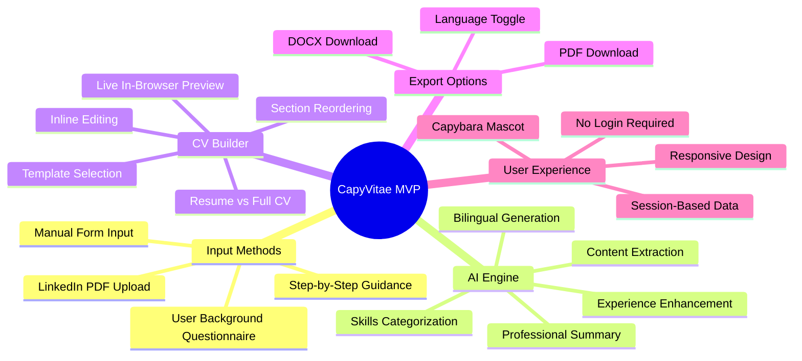
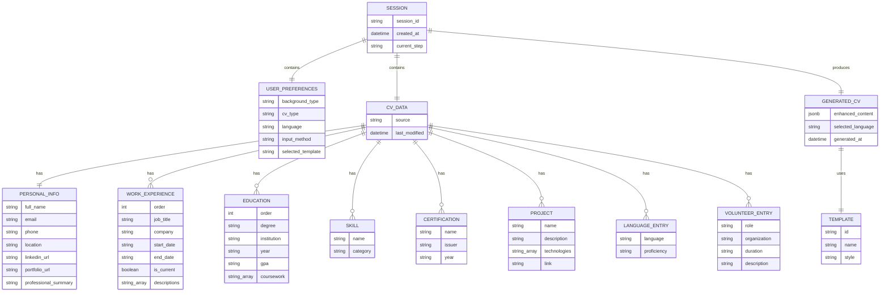
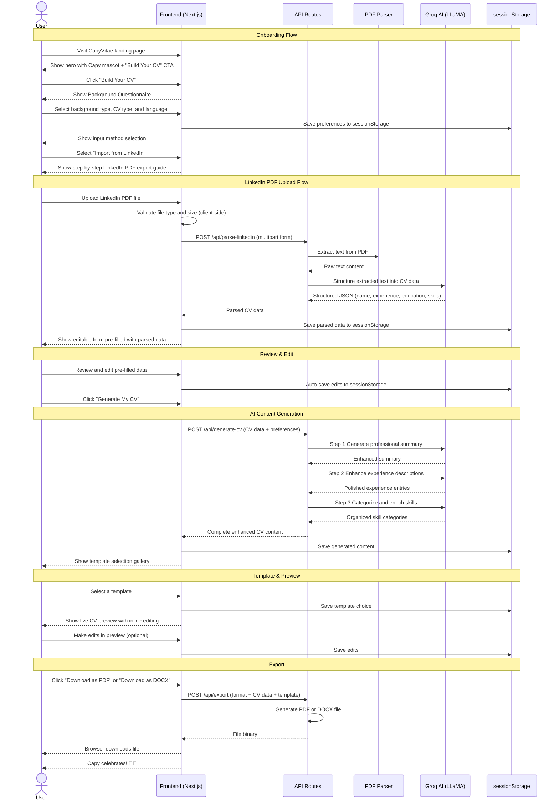
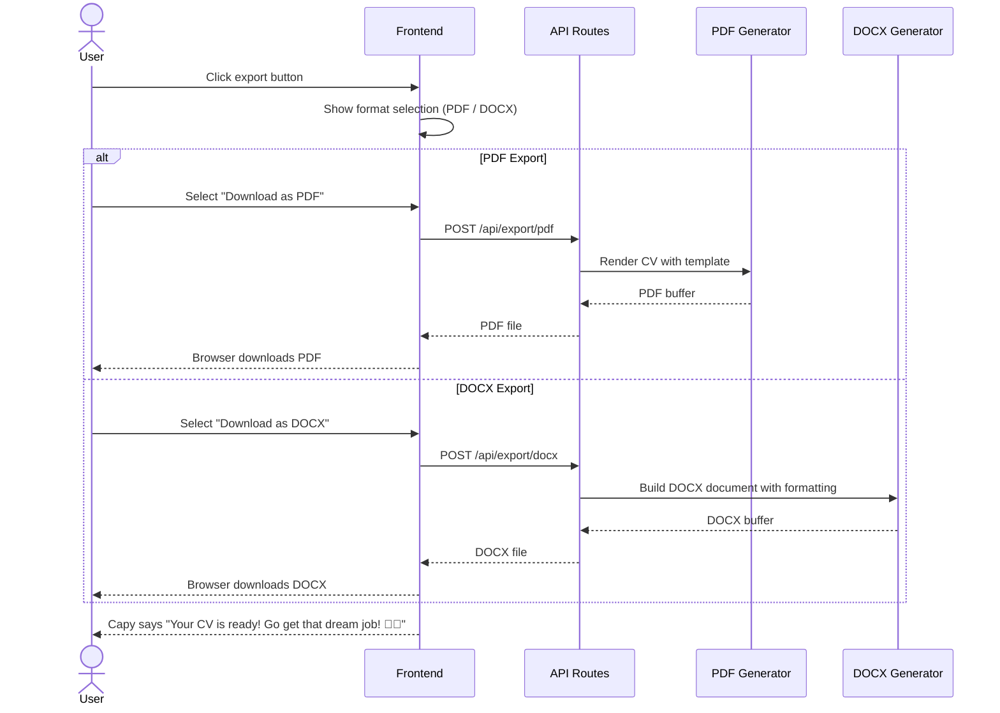
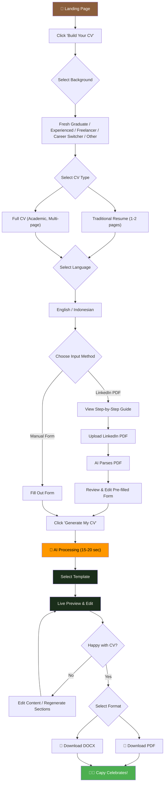

# 🦫 CapyVitae — Product Requirements Document (PRD)

**Version:** 1.0 (MVP)
**Author:** Product & Engineering Team
**Date:** July 10, 2026
**Status:** Draft

---

## Table of Contents

1. [Product Overview](#1-product-overview)
2. [Tech Stack](#2-tech-stack)
3. [Features & Requirements](#3-features--requirements)
4. [Data Model](#4-data-model)
5. [Application Sequence Diagram](#5-application-sequence-diagram)
6. [UX & Design Guidelines](#6-ux--design-guidelines)
7. [Core User Flow](#7-core-user-flow)
8. [Edge Cases & Error Handling](#8-edge-cases--error-handling)
9. [Success Metrics](#9-success-metrics)
10. [Open Questions & Future Considerations](#10-open-questions--future-considerations)

---

## 1. Product Overview

### 1.1 Vision Statement

> **CapyVitae** is a free, AI-powered CV/resume builder that takes the stress out of crafting the perfect CV. Import your LinkedIn profile or fill out a simple form, choose a template, and let AI do the heavy lifting — because building your career story should be as chill as a capybara. 🦫

### 1.2 Problem Statement

Job seekers — from fresh graduates to seasoned professionals — face recurring pain points when building their CV:

| Pain Point              | What the user thinks                                                                         |
| ----------------------- | -------------------------------------------------------------------------------------------- |
| **Blank Page Syndrome** | _"I don't know where to start. What do I even put on a CV?"_                                 |
| **Writing Paralysis**   | _"I know what I did, but I can't describe it professionally."_                               |
| **Format Anxiety**      | _"Is this the right layout? Does this template look professional enough?"_                   |
| **Time Pressure**       | _"I have to apply by tonight and I still don't have an updated CV."_                         |
| **Skill Articulation**  | _"How do I make my experience sound impressive without lying?"_                              |
| **Language Barrier**    | _"I need a CV in English/Indonesian but I'm not fluent enough to write one professionally."_ |

Existing solutions are either too expensive (professional CV writers at $100+), too rigid (drag-and-drop builders with zero intelligence), too complex (tools that require a 30-minute setup and registration), or require account creation that discourages first-time users.

### 1.3 Solution

CapyVitae solves this by:

1. **Zero friction entry** — No registration, no login, no saved data. Users jump straight into building their CV.
2. **Dual input paths** — Users can either upload their LinkedIn profile (exported as PDF) or fill out a structured form manually.
3. **AI-powered content generation** — Using Groq AI (powered by LLM models), the system transforms raw user data into polished, professional CV content.
4. **Template selection** — Users choose from multiple professionally designed templates for their CV.
5. **In-browser editing** — Users can preview and fine-tune the generated CV before downloading.
6. **Flexible output** — Download the final CV as PDF or DOCX.
7. **Bilingual support** — Generate CVs in English or Indonesian.

### 1.4 Target Users

| Persona                          | Description                                                                           | Key Need                                                     |
| -------------------------------- | ------------------------------------------------------------------------------------- | ------------------------------------------------------------ |
| **The Fresh Graduate**           | Just finished school, little to no work experience, needs their first professional CV | Help articulating academic projects, internships, and skills |
| **The Experienced Professional** | Switching roles or updating their CV for a new opportunity                            | Concise, impactful reframing of years of experience          |
| **The Freelancer / Contractor**  | Portfolio-based work, multiple clients, project-based history                         | Structured presentation of diverse project work              |
| **The Career Switcher**          | Changing industries entirely, needs to highlight transferable skills                  | Repositioning existing experience for a new field            |
| **The Non-Native Speaker**       | Needs a professional CV in English or Indonesian but struggles with fluency           | Natural, professional language generation                    |

### 1.5 Scope — MVP V1

**In Scope:**

- LinkedIn PDF import with step-by-step guidance
- Manual form input (alternative to LinkedIn)
- User background questionnaire (fresh grad, experienced, freelancer, etc.)
- AI-powered CV content generation via Groq API
- CV type selection: Traditional Resume (1–2 pages) or Full CV (academic-style, multi-page)
- Multiple professional templates (minimum 4)
- In-browser live preview and editing
- Download as PDF or DOCX
- Bilingual support: English and Indonesian
- Session-based data (no database, no authentication)
- Responsive web application
- Capybara mascot throughout the experience

**Out of Scope (V1):**

- User accounts / authentication
- Data persistence / database storage
- Cover letter generation
- Job board integration
- ATS (Applicant Tracking System) scoring
- Mock interview preparation
- Mobile native apps
- Languages beyond English and Indonesian

---

## 2. Tech Stack

### 2.1 Architecture Overview

CapyVitae follows a **serverless-first** architecture using Next.js for both frontend and backend. Since there's no database or authentication, the architecture is significantly simplified — all user data lives in the browser session.

```
┌──────────────────────────────────────────────────┐
│                    CLIENT                         │
│          Next.js (React + TypeScript)             │
│          Styled with Tailwind CSS v4              │
│     State: sessionStorage + React Context         │
│                                                   │
│  ┌────────────┐  ┌────────────┐  ┌────────────┐  │
│  │  LinkedIn   │  │  Manual    │  │  CV Live   │  │
│  │  PDF Upload │  │  Form      │  │  Editor    │  │
│  └────────────┘  └────────────┘  └────────────┘  │
└──────────────┬───────────────────────────────────┘
               │ HTTPS (API Routes)
┌──────────────▼───────────────────────────────────┐
│              SERVER (Next.js API Routes)           │
│  ┌─────────────┐  ┌──────────────────────────┐   │
│  │  PDF Parser  │  │   AI Content Generator   │   │
│  │  (pdf-parse) │  │   (Groq API — LLaMA)     │   │
│  └─────────────┘  └──────────────────────────┘   │
│  ┌─────────────┐  ┌──────────────────────────┐   │
│  │  PDF Export  │  │    DOCX Export            │   │
│  │ (@react-pdf) │  │    (docx library)         │   │
│  └─────────────┘  └──────────────────────────┘   │
└──────────────────────────────────────────────────┘
```

### 2.2 Technology Choices

| Layer                | Technology                         | Rationale                                                             |
| -------------------- | ---------------------------------- | --------------------------------------------------------------------- |
| **Framework**        | Next.js 15 (App Router)            | Full-stack React framework; SSR + API routes in one codebase          |
| **Language**         | TypeScript                         | Type safety, better DX, fewer runtime errors                          |
| **Styling**          | Tailwind CSS v4 + shadcn/ui        | Rapid UI development, consistent design system, accessible components |
| **State Management** | React Context + sessionStorage     | No database needed; data lives in browser session                     |
| **AI / LLM**         | Groq API (Llama 3.3 70B Versatile) | Blazing-fast inference, generous free tier, OpenAI-compatible API     |
| **PDF Parsing**      | `pdf-parse`                        | Extract text from uploaded LinkedIn PDF exports                       |
| **PDF Generation**   | `@react-pdf/renderer`              | Server-side PDF generation with custom templates                      |
| **DOCX Generation**  | `docx` (npm package)               | Programmatic DOCX file creation with formatting                       |
| **Deployment**       | Vercel                             | Optimized for Next.js, automatic previews, edge network, free tier    |
| **Monitoring**       | Vercel Analytics + Sentry          | Performance monitoring, error tracking                                |
| **Icons**            | Lucide React                       | Consistent, lightweight icon set                                      |
| **Fonts**            | Google Fonts (Nunito + Inter)      | Friendly (Nunito for headings) + Professional (Inter for body)        |

### 2.3 AI Model Strategy

| Task                               | Model                     | Max Tokens | Temperature | Rationale                                  |
| ---------------------------------- | ------------------------- | ---------- | ----------- | ------------------------------------------ |
| LinkedIn PDF Parsing & Structuring | `llama-3.3-70b-versatile` | 4,096      | 0.1         | Low creativity — factual extraction        |
| Professional Summary Generation    | `llama-3.3-70b-versatile` | 2,048      | 0.5         | Balanced — professional but engaging       |
| Work Experience Enhancement        | `llama-3.3-70b-versatile` | 4,096      | 0.4         | Moderate creativity — action-verb rewrites |
| Skills Categorization & Enrichment | `llama-3.3-70b-versatile` | 2,048      | 0.2         | Low creativity — accurate categorization   |
| Full CV Content Assembly           | `llama-3.3-70b-versatile` | 8,192      | 0.3         | Structured output — consistent formatting  |
| Indonesian Translation             | `llama-3.3-70b-versatile` | 8,192      | 0.2         | Low creativity — accurate translation      |

> **Note:** Groq's free tier allows ~30 RPM and ~1,000 requests/day. For the MVP, this is sufficient. If usage grows beyond free tier limits, we implement client-side queuing and consider the pay-as-you-go plan. The Groq API is OpenAI-compatible, so switching providers in the future requires only changing the base URL and API key.

> **Fallback Strategy:** If `llama-3.3-70b-versatile` is deprecated (scheduled August 2026), migrate to `openai/gpt-oss-120b` or the latest recommended production model on Groq.

---

## 3. Features & Requirements

### 3.1 Feature Map



### 3.2 Feature Details

#### F1: User Onboarding & Background Questionnaire

| ID   | Requirement                                                                      | Priority | Acceptance Criteria                                                                              |
| ---- | -------------------------------------------------------------------------------- | -------- | ------------------------------------------------------------------------------------------------ |
| F1.1 | Landing page with clear CTA to start building CV                                 | P0       | User can start in under 5 seconds from landing                                                   |
| F1.2 | User selects their **background type** before proceeding                         | P0       | Options: Fresh Graduate, Experienced Professional, Freelancer/Contractor, Career Switcher, Other |
| F1.3 | User selects **CV type**: Traditional Resume (1–2 pages) or Full CV (multi-page) | P0       | Selection affects template options and content structure                                         |
| F1.4 | User selects **language**: English (default) or Indonesian                       | P0       | Language selection persists through entire flow                                                  |
| F1.5 | User chooses **input method**: LinkedIn PDF Upload or Manual Form                | P0       | Clear visual choice with descriptions of each path                                               |
| F1.6 | Capybara mascot ("Capy") provides encouraging messages at each step              | P1       | Mascot appears contextually with helpful tips                                                    |

**Background Type Impact:**

| Background                   | Form Adjustments                                                         | AI Behavior                                                              |
| ---------------------------- | ------------------------------------------------------------------------ | ------------------------------------------------------------------------ |
| **Fresh Graduate**           | Emphasize education, projects, internships; de-emphasize work experience | AI highlights academic achievements, relevant coursework, volunteer work |
| **Experienced Professional** | Standard work experience focus, leadership, achievements                 | AI emphasizes quantifiable results, leadership, career progression       |
| **Freelancer/Contractor**    | Project-based entries, client types, portfolio links                     | AI structures around project deliverables and diverse skill sets         |
| **Career Switcher**          | Transferable skills section prominent, target role field                 | AI reframes existing experience for the target industry                  |
| **Other**                    | Full general form, all sections available                                | AI provides balanced, general-purpose CV content                         |

#### F2: LinkedIn PDF Import

| ID   | Requirement                                                             | Priority | Acceptance Criteria                                                                          |
| ---- | ----------------------------------------------------------------------- | -------- | -------------------------------------------------------------------------------------------- |
| F2.1 | Step-by-step visual guide showing how to export LinkedIn profile as PDF | P0       | 3–5 steps with screenshots/illustrations showing LinkedIn → "More" → "Save to PDF"           |
| F2.2 | User can upload their LinkedIn PDF (max 10MB)                           | P0       | File accepted, parsing begins, progress indicator shown                                      |
| F2.3 | AI extracts structured data from LinkedIn PDF                           | P0       | Extracted: name, headline, summary, experience, education, skills, certifications, languages |
| F2.4 | Parsed data is displayed in editable form for user review               | P0       | All extracted fields pre-filled and editable before CV generation                            |
| F2.5 | Non-PDF files are rejected with friendly error message                  | P0       | Capy mascot says: "Oops! I can only read PDF files. 🦫"                                      |
| F2.6 | Files exceeding 10MB are rejected                                       | P0       | Error: "That file is a bit too chunky! Please keep it under 10MB."                           |
| F2.7 | Poorly parsed data shows a fallback message                             | P1       | "I had trouble reading some parts. Please review and fill in any gaps!"                      |

**LinkedIn PDF Export Guide Steps:**

| Step | Instruction                                           | Visual                                                |
| ---- | ----------------------------------------------------- | ----------------------------------------------------- |
| 1    | Go to your LinkedIn profile page                      | Screenshot of LinkedIn profile page                   |
| 2    | Click the **"More"** button below your profile banner | Screenshot highlighting "More" button                 |
| 3    | Select **"Save to PDF"** from the dropdown menu       | Screenshot of dropdown with "Save to PDF" highlighted |
| 4    | Wait for the PDF to download to your device           | Download animation/illustration                       |
| 5    | Upload the downloaded PDF here!                       | Upload area highlight with drag-and-drop indicator    |

#### F3: Manual Form Input

| ID    | Requirement                                                  | Priority | Acceptance Criteria                                                                                                                    |
| ----- | ------------------------------------------------------------ | -------- | -------------------------------------------------------------------------------------------------------------------------------------- |
| F3.1  | Multi-section form with clear section headers                | P0       | Sections: Personal Info, Professional Summary, Work Experience, Education, Skills, Certifications, Languages, Projects, Volunteer Work |
| F3.2  | **Personal Information** section                             | P0       | Fields: Full Name*, Email*, Phone*, Location*, LinkedIn URL (optional), Portfolio/Website (optional)                                   |
| F3.3  | **Professional Summary** section                             | P1       | Optional free-text field (AI will generate one if left blank)                                                                          |
| F3.4  | **Work Experience** section with dynamic entries             | P0       | Repeatable entry: Job Title*, Company*, Start Date*, End Date (or "Present")*, Description (bullet points)                             |
| F3.5  | **Education** section with dynamic entries                   | P0       | Repeatable entry: Degree*, Institution*, Year\*, GPA (optional), Relevant Coursework (optional)                                        |
| F3.6  | **Skills** section                                           | P0       | Tag-based input; user types and adds skills as tags                                                                                    |
| F3.7  | **Certifications** section (optional)                        | P1       | Repeatable entry: Name, Issuer, Year                                                                                                   |
| F3.8  | **Languages** section                                        | P1       | Repeatable entry: Language, Proficiency Level (Native, Fluent, Intermediate, Basic)                                                    |
| F3.9  | **Projects** section (optional, highlighted for Fresh Grads) | P1       | Repeatable entry: Project Name, Description, Technologies Used, Link (optional)                                                        |
| F3.10 | **Volunteer / Extracurricular** section (optional)           | P2       | Repeatable entry: Role, Organization, Duration, Description                                                                            |
| F3.11 | Form auto-saves to sessionStorage on every change            | P0       | Data persists during page refreshes within the same session                                                                            |
| F3.12 | Form validation with inline error messages                   | P0       | Required fields show validation errors; non-blocking (user can proceed with warnings)                                                  |
| F3.13 | Contextual AI tips appear next to form fields                | P1       | Capy says: "Try using action verbs like 'Led', 'Built', 'Increased'..."                                                                |

**Form Sections by Background Type:**

| Section              | Fresh Graduate             | Experienced    | Freelancer                | Career Switcher               |
| -------------------- | -------------------------- | -------------- | ------------------------- | ----------------------------- |
| Personal Info        | ✅ Required                | ✅ Required    | ✅ Required               | ✅ Required                   |
| Professional Summary | ⬜ Optional (AI generates) | ✅ Recommended | ✅ Recommended            | ✅ Recommended                |
| Work Experience      | ⬜ Optional                | ✅ Required    | ✅ Required (as Projects) | ✅ Required                   |
| Education            | ✅ Required (prominent)    | ✅ Required    | ⬜ Optional               | ✅ Required                   |
| Skills               | ✅ Required                | ✅ Required    | ✅ Required               | ✅ Required (+ Target Skills) |
| Projects             | ✅ Highlighted             | ⬜ Optional    | ✅ Highlighted            | ⬜ Optional                   |
| Certifications       | ⬜ Optional                | ✅ Recommended | ✅ Recommended            | ✅ Highlighted                |
| Target Role          | ⬜ Hidden                  | ⬜ Hidden      | ⬜ Hidden                 | ✅ Required                   |

#### F4: AI Content Generation

| ID   | Requirement                                                                             | Priority | Acceptance Criteria                                                                 |
| ---- | --------------------------------------------------------------------------------------- | -------- | ----------------------------------------------------------------------------------- |
| F4.1 | AI generates a polished **Professional Summary** (3–5 sentences)                        | P0       | Tailored to user's background type and experience level                             |
| F4.2 | AI enhances **Work Experience** descriptions with action verbs and quantifiable results | P0       | Original meaning preserved; language elevated professionally                        |
| F4.3 | AI categorizes and prioritizes **Skills** (Technical, Soft, Tools, Languages)           | P0       | Skills grouped logically; most relevant skills listed first                         |
| F4.4 | AI generates content in the **selected language** (English or Indonesian)               | P0       | Professional-grade output in both languages                                         |
| F4.5 | AI adapts content based on **CV type** (Resume vs Full CV)                              | P0       | Resume: concise, 1–2 pages; Full CV: detailed, comprehensive                        |
| F4.6 | AI adapts tone/emphasis based on **background type**                                    | P0       | Fresh grad: academic focus; Professional: achievement focus; etc.                   |
| F4.7 | Content generation completes within 30 seconds                                          | P0       | Loading state with Capy mascot animation and progress steps                         |
| F4.8 | AI uses structured prompts with guardrails to prevent hallucination                     | P0       | AI only elaborates on provided data; never invents experience                       |
| F4.9 | AI provides a **"Content Quality Disclaimer"**                                          | P1       | "Capy did his best! Please review and edit to make sure everything is accurate. 🦫" |

**AI Generation Pipeline:**

```
┌─────────────────────────────────────────────────────┐
│ Step 1: Parse & Structure Raw Input (LinkedIn/Form) │
│ → Extract name, experience, education, skills       │
├─────────────────────────────────────────────────────┤
│ Step 2: Generate Professional Summary               │
│ → Based on background type + experience             │
├─────────────────────────────────────────────────────┤
│ Step 3: Enhance Experience Descriptions             │
│ → Action verbs, quantifiable results, conciseness   │
├─────────────────────────────────────────────────────┤
│ Step 4: Categorize & Enrich Skills                  │
│ → Group by type, add relevant adjacent skills       │
├─────────────────────────────────────────────────────┤
│ Step 5: Assemble Full CV Content                    │
│ → Apply CV type rules (resume vs full CV)           │
│ → Apply language (English or Indonesian)            │
├─────────────────────────────────────────────────────┤
│ Step 6: Format for Selected Template                │
│ → Structure data to fit template layout             │
└─────────────────────────────────────────────────────┘
```

#### F5: Template Selection

| ID   | Requirement                                                        | Priority | Acceptance Criteria                                                 |
| ---- | ------------------------------------------------------------------ | -------- | ------------------------------------------------------------------- |
| F5.1 | Minimum **4 professional templates** available at launch           | P0       | Each template has a distinct visual style                           |
| F5.2 | Template previews shown as thumbnails in a gallery                 | P0       | User can see how their data looks in each template before selecting |
| F5.3 | Templates adapt to **CV type** (resume condenses, full CV expands) | P0       | Resume: max 2 pages; Full CV: unlimited pages with sections         |
| F5.4 | Templates support **bilingual content** (EN/ID)                    | P0       | Section headers and labels adjust to selected language              |
| F5.5 | User can switch templates without losing content                   | P0       | Content is template-agnostic; only presentation changes             |
| F5.6 | Each template is available in both PDF and DOCX format             | P0       | Visual parity between PDF and DOCX versions                         |

**Template Catalog (MVP):**

| Template             | Style                                   | Best For                                    | Visual Character                     |
| -------------------- | --------------------------------------- | ------------------------------------------- | ------------------------------------ |
| **Capybara Classic** | Clean, single-column, modern serif      | All backgrounds                             | Warm, professional, timeless feel    |
| **Bamboo Modern**    | Two-column, sidebar for skills/contact  | Experienced professionals, career switchers | Contemporary, efficient use of space |
| **River Flow**       | Minimal, lots of whitespace, sans-serif | Fresh graduates, creative roles             | Clean, breathable, modern            |
| **Canopy Bold**      | Strong headers, accent color blocks     | Freelancers, tech professionals             | Bold, confident, eye-catching        |

#### F6: In-Browser Live Preview & Editing

| ID   | Requirement                                                         | Priority | Acceptance Criteria                                               |
| ---- | ------------------------------------------------------------------- | -------- | ----------------------------------------------------------------- |
| F6.1 | Real-time preview of CV with selected template                      | P0       | Preview updates as user edits content                             |
| F6.2 | User can **click to edit** any text section directly in the preview | P0       | Inline editing with auto-save to session                          |
| F6.3 | User can **reorder sections** via drag-and-drop                     | P1       | Sections snap into place with smooth animation                    |
| F6.4 | User can **add or remove sections**                                 | P1       | Toggle sections on/off (e.g., hide Volunteer if empty)            |
| F6.5 | Preview shows **page breaks** for multi-page CVs                    | P0       | Clear visual indicator of where pages split                       |
| F6.6 | Preview is responsive — zoom/scroll on mobile, full-size on desktop | P0       | Mobile: scrollable scaled-down preview; Desktop: near-actual-size |
| F6.7 | **"Regenerate"** button per section to re-run AI on that section    | P1       | User clicks "✨ Regenerate" next to a section, AI rewrites it     |
| F6.8 | Undo/Redo support for edits                                         | P2       | Ctrl+Z / Ctrl+Y works for text changes                            |

#### F7: Export & Download

| ID   | Requirement                                                             | Priority | Acceptance Criteria                                                        |
| ---- | ----------------------------------------------------------------------- | -------- | -------------------------------------------------------------------------- |
| F7.1 | User can download CV as **PDF**                                         | P0       | High-quality PDF matching the in-browser preview pixel-perfectly           |
| F7.2 | User can download CV as **DOCX**                                        | P0       | Properly formatted Word document with editable text, headings, and styling |
| F7.3 | Download button shows both format options                               | P0       | Toggle or dropdown: "Download as PDF" / "Download as DOCX"                 |
| F7.4 | File is named `[UserName]_CV_[Date].[ext]`                              | P1       | e.g., `Jane_Doe_CV_2026-07-10.pdf`                                         |
| F7.5 | Download triggers instantly (client-side for PDF, server-side for DOCX) | P0       | No more than 3 second wait for file generation                             |
| F7.6 | Capy mascot celebrates after download                                   | P1       | "Your CV is ready! Go get that dream job! 🦫🎉"                            |

---

## 4. Data Model

### 4.1 Session Data Structure

Since CapyVitae is fully session-based with no database, all data lives in the browser's `sessionStorage` and React Context. The data model represents the in-memory state.



### 4.2 Session State Schema

**`sessionStorage` Key: `capyvitae_session`**

```json
{
  "sessionId": "cv_1720594800000_abc123",
  "createdAt": "2026-07-10T10:00:00Z",
  "currentStep": "preview",
  "preferences": {
    "backgroundType": "experienced_professional",
    "cvType": "resume",
    "language": "en",
    "inputMethod": "linkedin_pdf",
    "selectedTemplate": "bamboo_modern"
  },
  "cvData": {
    "source": "linkedin_pdf",
    "lastModified": "2026-07-10T10:05:00Z",
    "personalInfo": {
      "fullName": "Jane Doe",
      "email": "jane@example.com",
      "phone": "+62-812-3456-7890",
      "location": "Jakarta, Indonesia",
      "linkedinUrl": "linkedin.com/in/janedoe",
      "portfolioUrl": "janedoe.dev",
      "professionalSummary": ""
    },
    "workExperience": [
      {
        "order": 1,
        "jobTitle": "Senior Software Engineer",
        "company": "TechCorp Indonesia",
        "startDate": "2021-03",
        "endDate": "present",
        "isCurrent": true,
        "descriptions": [
          "Led a team of 5 engineers",
          "Reduced API latency by 40%"
        ]
      }
    ],
    "education": [
      {
        "order": 1,
        "degree": "B.S. Computer Science",
        "institution": "Universitas Indonesia",
        "year": "2018",
        "gpa": "3.8",
        "coursework": ["Data Structures", "Machine Learning"]
      }
    ],
    "skills": [
      { "name": "TypeScript", "category": "technical" },
      { "name": "Leadership", "category": "soft" },
      { "name": "AWS", "category": "tools" }
    ],
    "certifications": [
      { "name": "AWS Solutions Architect", "issuer": "Amazon", "year": "2023" }
    ],
    "projects": [],
    "languages": [
      { "language": "Indonesian", "proficiency": "native" },
      { "language": "English", "proficiency": "fluent" }
    ],
    "volunteer": []
  },
  "generatedCV": {
    "enhancedContent": {
      "professionalSummary": "Results-driven Senior Software Engineer with 5+ years...",
      "enhancedExperience": ["..."],
      "categorizedSkills": { "technical": ["..."], "soft": ["..."] }
    },
    "selectedLanguage": "en",
    "generatedAt": "2026-07-10T10:06:00Z"
  }
}
```

---

## 5. Application Sequence Diagram

### 5.1 LinkedIn PDF Import Flow



### 5.2 Manual Form Input Flow

```mermaid
sequenceDiagram
    actor User
    participant UI as Frontend (Next.js)
    participant API as API Routes
    participant AI as Groq AI (LLaMA)
    participant Session as sessionStorage

    Note over User, Session: Onboarding (same as above)
    User->>UI: Select "Fill Out Form Manually"
    UI-->>User: Show form adapted to background type

    Note over User, Session: Form Entry
    User->>UI: Fill in Personal Information
    UI->>Session: Auto-save after each field
    User->>UI: Add Work Experience entries
    UI->>Session: Auto-save
    User->>UI: Add Education entries
    UI->>Session: Auto-save
    User->>UI: Add Skills as tags
    UI->>Session: Auto-save
    User->>UI: Fill optional sections (certs, projects, volunteer)
    UI->>Session: Auto-save

    User->>UI: Click "Generate My CV"
    UI->>API: POST /api/generate-cv

    rect rgb(40, 80, 60)
        Note over API, AI: AI Processing Pipeline
        API->>AI: Generate professional summary from form data
        AI-->>API: Summary
        API->>AI: Enhance experience descriptions
        AI-->>API: Enhanced descriptions
        API->>AI: Categorize skills
        AI-->>API: Categorized skills
    end

    API-->>UI: Enhanced CV content
    UI->>Session: Save generated content
    UI-->>User: Show template gallery then live preview
```



### 5.3 Export Flow



---

## 6. UX & Design Guidelines

### 6.1 Design Principles

| Principle            | Description                                                                                                               |
| -------------------- | ------------------------------------------------------------------------------------------------------------------------- |
| **Chill & Friendly** | The UI should feel warm, inviting, and stress-free — like a capybara lounging by a hot spring. No corporate coldness.     |
| **Zero Friction**    | No registration walls. Users should go from landing to CV in minutes. Every interaction should feel effortless.           |
| **Guided Journey**   | Users should never feel lost. Clear step indicators, contextual help, and the Capy mascot guide them through the process. |
| **Show, Don't Tell** | Live previews, visual templates, and real-time feedback over walls of text and instructions.                              |
| **Encouraging Tone** | Copy should be warm and supportive. Even error messages should make users smile, not panic.                               |
| **Mobile-Friendly**  | The form and flow should work on mobile. Preview can be scrollable/zoomable on smaller screens.                           |

### 6.2 Brand Identity

| Element          | Specification                                                                                                                                                                                            |
| ---------------- | -------------------------------------------------------------------------------------------------------------------------------------------------------------------------------------------------------- |
| **App Name**     | CapyVitae                                                                                                                                                                                                |
| **Tagline**      | _"Chill. Build. Land the job. 🦫"_                                                                                                                                                                       |
| **Logo Concept** | A friendly capybara silhouette holding/wearing a graduation cap or briefcase. Rounded, approachable, memorable.                                                                                          |
| **Mascot**       | **"Capy"** — the CapyVitae capybara mascot. Appears in onboarding, loading states, empty states, tips, celebrations, and error messages. Multiple poses: thinking, waving, celebrating, sleeping (idle). |
| **Personality**  | Friendly, encouraging, slightly humorous. Capy speaks in short, supportive sentences. Never condescending.                                                                                               |

### 6.3 Color Palette

| Token                | Hex       | Usage                                                                  |
| -------------------- | --------- | ---------------------------------------------------------------------- |
| **Primary**          | `#8B5E3C` | Buttons, links, active states (warm brown — earthy, capybara-inspired) |
| **Primary Light**    | `#A67C5B` | Hover states, secondary elements                                       |
| **Primary Dark**     | `#6B4226` | Pressed states, headings                                               |
| **Secondary**        | `#4CAF50` | Accents, success states, CTA highlights (lush green — nature/bamboo)   |
| **Secondary Light**  | `#81C784` | Light accents, badges                                                  |
| **Accent**           | `#FF9800` | Warnings, special highlights (warm orange — capybara fur accent)       |
| **Background**       | `#0F1A0F` | Main dark background (deep forest green-black)                         |
| **Surface**          | `#1A2E1A` | Cards, panels (dark green-tinted)                                      |
| **Surface Elevated** | `#253525` | Modals, dropdowns, tooltips                                            |
| **Text Primary**     | `#F5F1EB` | Main body text (warm white)                                            |
| **Text Secondary**   | `#9CA89C` | Muted text, labels, placeholders                                       |
| **Success**          | `#4CAF50` | Completed states, success messages                                     |
| **Warning**          | `#FF9800` | Warnings, attention items                                              |
| **Error**            | `#EF5350` | Errors, validation failures                                            |
| **Info**             | `#42A5F5` | Informational elements, tips                                           |

> **Design Note:** The color palette is inspired by the capybara's natural habitat — warm earthy browns, deep forest greens, and natural tones. The dark theme creates a premium, modern feel while remaining cozy and inviting.

### 6.4 Typography

| Element                   | Font               | Weight         | Size               |
| ------------------------- | ------------------ | -------------- | ------------------ |
| **Headings (H1–H3)**      | Nunito             | 700 (Bold)     | 36px / 28px / 22px |
| **Body**                  | Inter              | 400 (Regular)  | 16px               |
| **Small / Caption**       | Inter              | 400            | 14px               |
| **Button Text**           | Nunito             | 600 (SemiBold) | 16px               |
| **Mascot Speech Bubbles** | Nunito             | 500 (Medium)   | 15px               |
| **Form Labels**           | Inter              | 500 (Medium)   | 14px               |
| **CV Preview Text**       | Varies by template | —              | —                  |

### 6.5 Component Guidelines

**Cards:**

- Rounded corners: `16px`
- Background: `Surface` color with subtle border (`1px solid rgba(139, 94, 60, 0.15)`)
- Box shadow: `0 4px 24px rgba(0, 0, 0, 0.2)`
- Padding: `24px`
- Hover: subtle glow effect with `Primary Light`

**Buttons:**

- Primary: Filled with `Primary` color, warm white text, subtle gradient
- Secondary: Outlined with `Primary` border, transparent background
- Ghost: No border, text-only, hover reveals background
- Rounded corners: `12px`
- Height: `48px` (touch-friendly)
- Hover: lift effect (`translateY(-2px)`) + subtle shadow
- Active: press effect (`translateY(0)`)
- Loading: spinner replaces text

**Form Fields:**

- Background: `Surface` color
- Border: `1px solid rgba(255, 255, 255, 0.1)`
- Focus border: `Primary` color with subtle glow
- Rounded corners: `10px`
- Padding: `12px 16px`
- Placeholder: `Text Secondary` color

**Template Cards:**

- Aspect ratio: A4 (1:1.414)
- Thumbnail preview of actual template
- Selected state: `Primary` border + checkmark badge
- Hover: scale up slightly (`1.03`) + shadow

**Mascot (Capy):**

- Appears as a small illustration (80px–120px)
- Speech bubble with rounded corners and a tail pointer
- Subtle bounce animation on appear
- Multiple states: default, thinking (for loading), celebrating (for success), confused (for errors)

**Loading States:**

- Capy mascot with animated thinking dots ("...")
- Step-by-step progress: "Parsing your profile → Enhancing your experience → Polishing your skills → Assembling your CV"
- Skeleton screens for content areas
- Estimated time: "This usually takes about 15–20 seconds ☕"

### 6.6 Responsive Breakpoints

| Breakpoint  | Width          | Layout                                                                  |
| ----------- | -------------- | ----------------------------------------------------------------------- |
| **Mobile**  | < 640px        | Single column; form steps stacked; CV preview scrollable and zoomed out |
| **Tablet**  | 640px – 1024px | Two-column where appropriate; form beside mini-preview                  |
| **Desktop** | > 1024px       | Full layout; form/options on left, live preview on right (side-by-side) |

### 6.7 Page Map

| Page                | Route              | Description                                                |
| ------------------- | ------------------ | ---------------------------------------------------------- |
| Landing / Hero      | `/`                | Capy mascot hero, value proposition, "Build Your CV" CTA   |
| Onboarding          | `/build`           | Background type, CV type, language, input method selection |
| LinkedIn Guide      | `/build/linkedin`  | Step-by-step guide + PDF upload area                       |
| Manual Form         | `/build/form`      | Multi-section editable form                                |
| Template Gallery    | `/build/templates` | Template selection with previews                           |
| CV Preview & Editor | `/build/preview`   | Live CV preview with inline editing + download             |

---

## 7. Core User Flow

### 7.1 Primary Happy Path



### 7.2 Step-by-Step Walkthrough

| Step | Screen           | User Action                                                          | System Response                                                                                                    |
| ---- | ---------------- | -------------------------------------------------------------------- | ------------------------------------------------------------------------------------------------------------------ |
| 1    | Landing          | Views hero with Capy mascot. Clicks "Build Your CV"                  | Smooth scroll/navigate to onboarding                                                                               |
| 2    | Onboarding       | Selects "Experienced Professional"                                   | Background saved; form adapts                                                                                      |
| 3    | Onboarding       | Selects "Traditional Resume"                                         | CV type saved                                                                                                      |
| 4    | Onboarding       | Selects "English"                                                    | Language saved                                                                                                     |
| 5    | Onboarding       | Chooses "Import from LinkedIn"                                       | Navigate to LinkedIn guide                                                                                         |
| 6    | LinkedIn Guide   | Views 5-step visual guide, exports profile from LinkedIn             | Guide shows screenshots for each step                                                                              |
| 7    | LinkedIn Guide   | Uploads LinkedIn PDF                                                 | File validated, upload progress shown                                                                              |
| 8    | LinkedIn Guide   | Waits 5–10 seconds                                                   | Capy thinking animation: "Reading your profile..." → "Found your experience!"                                      |
| 9    | Editable Form    | Reviews pre-filled data, edits job descriptions, adds missing skills | Form auto-saves. Capy tips appear: "Try adding numbers like 'increased revenue by 30%'"                            |
| 10   | Editable Form    | Clicks "Generate My CV ✨"                                           | Button transitions to loading state                                                                                |
| 11   | Loading          | Waits 15–20 seconds                                                  | Capy animation + progress steps: "Crafting your summary → Polishing experience → Organizing skills → Almost done!" |
| 12   | Template Gallery | Browses 4 templates, clicks on "Bamboo Modern"                       | Template highlighted, preview thumbnail shown                                                                      |
| 13   | Preview & Editor | Views full CV preview. Clicks on summary to edit a sentence.         | Inline editor opens, text is editable. Changes reflect instantly in preview.                                       |
| 14   | Preview & Editor | Clicks "✨ Regenerate" on the Skills section                         | AI re-generates just that section. Other sections unchanged.                                                       |
| 15   | Preview & Editor | Satisfied. Clicks "Download"                                         | Format selection appears: PDF / DOCX                                                                               |
| 16   | Export           | Selects "Download as PDF"                                            | PDF generated and downloaded. Filename: `Jane_Doe_CV_2026-07-10.pdf`                                               |
| 17   | Success          | Sees celebration screen                                              | Capy with party hat: "Your CV is ready! Go get that dream job! 🦫🎉"                                               |

---

## 8. Edge Cases & Error Handling

### 8.1 Input Validation Errors

| Scenario                                    | Detection                                  | User Message (Capy says)                                                                                 | Recovery                                             |
| ------------------------------------------- | ------------------------------------------ | -------------------------------------------------------------------------------------------------------- | ---------------------------------------------------- |
| Non-PDF file uploaded                       | Client-side MIME check + server validation | "Oops! I can only read PDF files. Please upload a .pdf file! 🦫"                                         | Show upload area again                               |
| PDF exceeds 10MB                            | Client-side size check                     | "That file is a bit too chunky! Please keep it under 10MB. 🦫"                                           | Show upload area again                               |
| Corrupt / unreadable PDF                    | Server-side: pdf-parse throws error        | "Hmm, I couldn't read this PDF. It might be damaged. Try re-exporting from LinkedIn! 🦫"                 | Show re-upload option + link to guide                |
| LinkedIn PDF has very little content        | AI extraction returns minimal data         | "I found some info, but it looks like your LinkedIn might be sparse. You can fill in the gaps below! 🦫" | Show form with whatever was extracted, rest editable |
| Required form field empty on submit         | Client-side validation                     | "Don't forget to fill in your [field name]! It's important for your CV. 🦫"                              | Highlight missing field, scroll to it                |
| Invalid email format                        | Client-side regex                          | "That email doesn't look quite right. Double-check it? 🦫"                                               | Highlight email field                                |
| No work experience AND no education entered | Submit validation                          | "A CV needs at least some experience or education. Let's add something! 🦫"                              | Focus on relevant section                            |

### 8.2 AI / Processing Errors

| Scenario                                | Detection                               | User Message (Capy says)                                                        | Recovery                                                              |
| --------------------------------------- | --------------------------------------- | ------------------------------------------------------------------------------- | --------------------------------------------------------------------- |
| Groq API timeout (> 60s)                | Server-side timeout handler             | "I'm thinking extra hard on this one... Let me try again! 🦫"                   | Auto-retry once; then "Retry" button                                  |
| Groq API rate limited (429)             | HTTP status code 429                    | "Lots of people are building CVs right now! Please wait a moment. 🦫"           | Auto-retry with exponential backoff (3 attempts); show estimated wait |
| Groq API error (500)                    | HTTP status code                        | "Something went wrong on my end. Let me try that again! 🦫"                     | "Retry" button; log to Sentry                                         |
| AI returns malformed JSON               | JSON parse error                        | "I got a bit confused. Retrying... 🦫"                                          | Auto-retry with stricter prompt                                       |
| AI generates content not matching input | Output validation (name mismatch, etc.) | "Hmm, something doesn't look right. Please review the highlighted sections. 🦫" | Highlight suspicious content; user can edit                           |
| AI hallucinates fake experience         | Content guardrails check                | Not shown to user; silently filtered                                            | Re-prompt with explicit "only use provided data" instruction          |
| Partial generation failure              | One AI step fails, others succeed       | "I got most of your CV ready! A few sections need your touch though. 🦫"        | Show completed sections; "Retry" button for failed ones               |

### 8.3 Session & Data Errors

| Scenario                                  | Detection                          | User Message (Capy says)                                                                            | Recovery                                                            |
| ----------------------------------------- | ---------------------------------- | --------------------------------------------------------------------------------------------------- | ------------------------------------------------------------------- |
| sessionStorage full                       | try/catch on setItem               | "Your browser's memory is full. I'll keep your data in memory, but don't close this tab! 🦫"        | Fall back to React Context only; warn user                          |
| User refreshes mid-generation             | Page load detects incomplete state | "Welcome back! Looks like we were in the middle of something. Let me pick up where we left off. 🦫" | Restore session data; re-trigger generation                         |
| User closes tab (data lost)               | N/A — cannot prevent               | N/A                                                                                                 | Landing page on return. Capy greets with "Ready to build a new CV?" |
| sessionStorage cleared (private browsing) | Feature detection                  | "Heads up: you're in private browsing mode. Your data won't be saved if you close this tab. 🦫"     | Show one-time notice                                                |

### 8.4 Export Errors

| Scenario                    | Detection                      | User Message (Capy says)                                                                                  | Recovery                                 |
| --------------------------- | ------------------------------ | --------------------------------------------------------------------------------------------------------- | ---------------------------------------- |
| PDF generation fails        | Server-side rendering error    | "I had trouble creating your PDF. Let me try again! 🦫"                                                   | Retry button; fallback to basic PDF      |
| DOCX generation fails       | docx library error             | "The Word file didn't come out right. Let me try again! 🦫"                                               | Retry button; suggest PDF as alternative |
| Download blocked by browser | Client-side download detection | "Your browser might be blocking the download. Check your downloads bar or try right-clicking to save. 🦫" | Provide direct download link as fallback |

### 8.5 Network & Browser Errors

| Scenario                               | Detection                      | User Message (Capy says)                                                                               | Recovery                                  |
| -------------------------------------- | ------------------------------ | ------------------------------------------------------------------------------------------------------ | ----------------------------------------- |
| User loses internet                    | navigator.onLine + fetch error | "Looks like you're offline. Don't worry, your data is saved locally! Reconnect and we'll continue. 🦫" | Auto-detect reconnection; resume          |
| Slow network (API > 30s)               | Timeout threshold              | "This is taking longer than usual. Hang tight! 🦫"                                                     | Extended timeout; show progress indicator |
| Browser doesn't support sessionStorage | Feature detection on load      | "Your browser doesn't support some features we need. Please try Chrome, Firefox, Safari, or Edge. 🦫"  | Graceful degradation message              |

---

## 9. Success Metrics

### 9.1 North Star Metric

> **CVs Downloaded Per Week** — The number of CVs successfully generated and downloaded (PDF + DOCX combined) per week. This directly measures core value delivery — a completed download means the user found enough value to take away a tangible output.

### 9.2 Key Performance Indicators (KPIs)

#### Acquisition Metrics

| Metric                                | Target (Month 1) | Target (Month 3) | Measurement              |
| ------------------------------------- | ---------------- | ---------------- | ------------------------ |
| **Unique Visitors**                   | 2,000            | 10,000           | Vercel Analytics         |
| **Landing → "Build CV" Click Rate**   | 30%              | 45%              | Click tracking           |
| **"Build CV" → Completed Onboarding** | 70%              | 80%              | Step completion tracking |

#### Engagement Metrics

| Metric                                             | Target (Month 1)            | Target (Month 3)                | Measurement             |
| -------------------------------------------------- | --------------------------- | ------------------------------- | ----------------------- |
| **Onboarding → CV Downloaded (Funnel Completion)** | 40%                         | 55%                             | Funnel analytics        |
| **LinkedIn PDF Upload vs Manual Form**             | 40% / 60%                   | 50% / 50%                       | Input method tracking   |
| **Average Time to Download**                       | < 8 minutes                 | < 6 minutes                     | Session timestamp       |
| **Template Selection Distribution**                | Balanced across 4 templates | Track for template optimization | Template click tracking |
| **"Regenerate" Feature Usage**                     | 20% of users                | 30% of users                    | Button click tracking   |
| **Second CV in Same Session**                      | 5%                          | 10%                             | Session tracking        |
| **DOCX vs PDF Download Ratio**                     | Track                       | Track                           | Export format tracking  |

#### Quality Metrics

| Metric                                 | Target       | Measurement                             |
| -------------------------------------- | ------------ | --------------------------------------- |
| **AI Content Generation Success Rate** | > 95%        | Successful generations / total attempts |
| **Average Generation Time**            | < 20 seconds | Time from "Generate" click to preview   |
| **LinkedIn PDF Parse Success Rate**    | > 85%        | Successful parses / total uploads       |
| **Export Success Rate (PDF + DOCX)**   | > 98%        | Successful exports / total attempts     |
| **Groq API Error Rate**                | < 3%         | Failed API calls / total calls          |

#### Satisfaction Metrics

| Metric                           | Target    | Measurement                                 |
| -------------------------------- | --------- | ------------------------------------------- |
| **Post-Download Rating**         | > 4.0/5.0 | Optional 1-click star rating after download |
| **"Would you recommend?" (NPS)** | > 40      | Optional post-download question             |
| **Social Shares**                | 50/month  | Track share button clicks                   |

### 9.3 Guardrail Metrics

> **Warning:** These metrics should NOT degrade. If they breach thresholds, investigate immediately.

| Guardrail                  | Threshold                              | Alert                                    |
| -------------------------- | -------------------------------------- | ---------------------------------------- |
| **P95 Page Load Time**     | < 3 seconds                            | Vercel monitoring                        |
| **AI Generation P95 Time** | < 45 seconds                           | Server-side monitoring                   |
| **Groq API Daily Usage**   | < 800 requests/day (80% of free limit) | API usage dashboard                      |
| **Client-Side Error Rate** | < 1%                                   | Sentry                                   |
| **Drop-off at Form Step**  | < 40%                                  | Funnel analytics (action: simplify form) |

---

## 10. Open Questions & Future Considerations

### 10.1 Open Questions for V1

| #    | Question                                                                 | Options                                                                                                           | Decision Owner | Status             |
| ---- | ------------------------------------------------------------------------ | ----------------------------------------------------------------------------------------------------------------- | -------------- | ------------------ |
| OQ-1 | **How many templates should we ship with V1?**                           | (a) 4 templates as specified (b) 3 to ship faster (c) 6 for more variety                                          | Design + Eng   | Option (b) for now |
| OQ-2 | **Should we add ATS compatibility scoring in V1?**                       | (a) No, keep V1 simple (b) Yes, show a basic "ATS-friendly" badge per template                                    | Product        | Option (a) for now |
| OQ-3 | **How to handle LinkedIn PDFs in non-English languages?**                | (a) Parse best-effort, let user fix (b) Auto-detect language and translate (c) Only support English LinkedIn PDFs | Eng            | Option (a) for now |
| OQ-4 | **Should we offer a light mode as well?**                                | (a) Dark mode only for V1 (b) Dark + Light toggle from day one                                                    | Design         | Option (a) for now |
| OQ-5 | **Cookie/privacy banner needed?**                                        | (a) No — we don't use cookies or store data (b) Minimal banner for analytics                                      | Legal          | Option (b) for now |
| OQ-6 | **Should we allow direct text paste from LinkedIn (copy profile text)?** | (a) Not in V1, PDF only (b) Add as third input option                                                             | Product + Eng  | Option (a) for now |
| OQ-7 | **Groq API key management — single key or user-provided?**               | (a) Single server-side key (our key) (b) Let users optionally provide their own key for higher limits             | Eng            | Option (a) for now |

### 10.2 Future Considerations (V2+)

#### V2 — Enhanced Features

| Feature                      | Description                                                                  | Estimated Effort                    |
| ---------------------------- | ---------------------------------------------------------------------------- | ----------------------------------- |
| **Cover Letter Generator**   | AI generates a matching cover letter based on CV + job description           | Medium (3–4 weeks)                  |
| **ATS Score & Optimization** | Scan CV against job descriptions, suggest improvements for ATS compatibility | Medium (4–5 weeks)                  |
| **Additional Languages**     | Support for Malay, Vietnamese, Thai, and other Southeast Asian languages     | Small per language (1–2 weeks each) |
| **More Templates**           | Community-contributed and premium template designs                           | Ongoing                             |
| **Light Mode**               | Full light theme toggle                                                      | Small (1–2 weeks)                   |
| **Job Description Input**    | Paste a job description, AI tailors CV specifically for that role            | Medium (3–4 weeks)                  |

#### V3 — Platform & Growth

| Feature                         | Description                                                | Estimated Effort   |
| ------------------------------- | ---------------------------------------------------------- | ------------------ |
| **User Accounts (Optional)**    | Optional sign-up to save CVs, access from multiple devices | Medium (4–6 weeks) |
| **CV History & Versions**       | Save multiple versions of CVs, compare changes             | Medium (4–5 weeks) |
| **Portfolio/Website Generator** | Generate a simple portfolio website from CV data           | Large (8–10 weeks) |
| **LinkedIn Direct Integration** | OAuth-based LinkedIn import (if API access obtained)       | Medium (4–6 weeks) |
| **AI Interview Prep**           | Generate likely interview questions based on CV content    | Medium (4–6 weeks) |

#### V4 — Monetization & Enterprise

| Feature                     | Description                                                   | Estimated Effort    |
| --------------------------- | ------------------------------------------------------------- | ------------------- |
| **Premium Templates**       | Designer templates behind a one-time purchase or subscription | Medium (4–6 weeks)  |
| **University Partnerships** | White-labeled version for university career centers           | Large (8–12 weeks)  |
| **Team / Recruiter Tools**  | Bulk CV processing for recruitment agencies                   | Large (10–14 weeks) |
| **API Access**              | Third-party integrations for HR platforms                     | Medium (4–6 weeks)  |
| **AI Model Upgrade**        | Upgrade to more powerful models for better content quality    | Small (1–2 weeks)   |

### 10.3 Technical Debt & Architecture Considerations

| Item                         | Description                                                       | When to Address                   |
| ---------------------------- | ----------------------------------------------------------------- | --------------------------------- |
| **Database Addition**        | Add PostgreSQL/Supabase when user accounts are introduced         | V3 — When user accounts are added |
| **AI Provider Abstraction**  | Abstract Groq API behind an interface for easy provider switching | Before Groq model deprecations    |
| **Template Engine Refactor** | Move from hardcoded templates to a dynamic template engine        | When template count > 8           |
| **Rate Limiting**            | Implement server-side rate limiting per IP to prevent abuse       | Before public launch              |
| **CDN for Static Assets**    | Serve template assets, fonts, and mascot images via CDN           | When traffic > 10k users/month    |
| **E2E Testing**              | Playwright tests for critical user flows                          | Before V1 launch                  |
| **Accessibility Audit**      | WCAG 2.1 AA compliance review                                     | Before V1 launch                  |

### 10.4 Risks & Mitigations

| Risk                                | Likelihood | Impact | Mitigation                                                                                                            |
| ----------------------------------- | ---------- | ------ | --------------------------------------------------------------------------------------------------------------------- |
| **Groq free tier rate limits hit**  | High       | Medium | Implement request queuing; show "busy" state; consider pay-as-you-go or alternative provider                          |
| **Groq model deprecation**          | High       | Medium | API is OpenAI-compatible; migration to new model is a config change. Monitor deprecation notices.                     |
| **LinkedIn PDF format changes**     | Medium     | High   | PDF parsing is text-based, not layout-dependent; maintain fallback to manual form                                     |
| **AI generates inaccurate content** | Medium     | High   | Strict prompts ("only use provided data"); mandatory user review step; content disclaimer                             |
| **Session data loss**               | Medium     | Medium | Warn users about session limits; suggest download early; consider optional localStorage backup                        |
| **Low adoption**                    | Medium     | High   | SEO optimization; social media presence (TikTok/Instagram with Capy mascot); university outreach; Product Hunt launch |
| **DOCX formatting issues**          | Medium     | Low    | Extensive testing across Word versions; keep formatting simple; PDF as primary recommendation                         |
| **Abuse / spam generation**         | Low        | Medium | Rate limit by IP; CAPTCHA after 5 generations per session; monitor usage patterns                                     |
| **Browser compatibility issues**    | Low        | Medium | Target last 2 versions of Chrome, Firefox, Safari, Edge; progressive enhancement                                      |

---

**Next Steps:**

1. Resolve Open Questions (OQ-1 through OQ-7) in product sync
2. Design Capy mascot illustrations (default, thinking, celebrating, confused poses)
3. Create high-fidelity wireframes for all 6 pages
4. Design 4 CV templates (Capybara Classic, Bamboo Modern, River Flow, Canopy Bold)
5. Set up Next.js project with Tailwind CSS v4 + shadcn/ui
6. Secure Groq API key and test model availability
7. Begin Sprint 1: Landing Page + Onboarding Flow + Manual Form
8. Begin Sprint 2: LinkedIn PDF Parsing + AI Content Generation
9. Begin Sprint 3: Template Engine + Preview/Editor + Export

---

_This document is a living artifact and should be updated as decisions are made and requirements evolve. Last updated: July 10, 2026._

_Built with ❤️ and 🦫 by the CapyVitae team._
